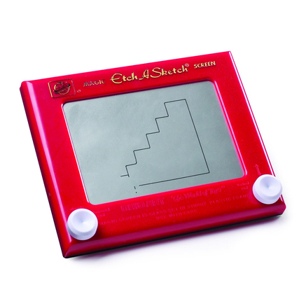
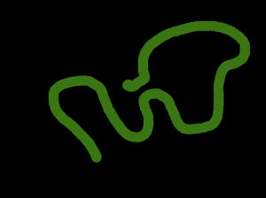

Arduino Etch A Sketch Workshop
======================

## What is an Etch A Sketch?

An Etch A Sketch is a drawing toy that was sold by the Ohio Art Company. It was first sold in the 1960s.  The toy draws a line using two controllers: a knob that changes the horizontal position and a second knob for the vertical position.  To erase what has been drawn, the toy is flipped upside down and is shaken.

We are going to mimic this interaction using Arduino and Processing.  We will use Processing to draw on a computer, and we will control that drawing using two potentiomenters and a tactile button.

## 1. Processing Sketch

### Setting up the sketch
First we set up the sketch as we would any Processing sketch with `setup` and `draw` functions.

	void setup() {
		size( 800, 600 );
	}
	
	void draw() {
	
	}

### Drawing with the mouse
Now we are ready to add some interaction.

#### Exercise 1
Use the `ellipse` shape to draw a trail of circles wherever the mouse goes.

#### Exercise 2
If you haven't already, use variables to control the colour and diameter of the circles.

### Clearing with a key press
Now that we have a trail of circles wherever the mouse moved, we need to add functionality to clear the screen.  We will use the `keyPressed` function.

	void keyPressed() {
	
	}

The `keyPressed` function is called whenever a key on the keyboard is pressed.

#### Exercise 3
Using the `background` function, clear the screen every time a key is pressed.

#### Exercise 4
If you haven't done so already, use a variable or multiple variables to set the background color.

## 2. Adding a Button
### The circuit
### The Arduino code
### The Processing code

## 3. Adding the First Knob
### The circuit
### The Arduino code
### The Processing code

## 4. Adding the Second Knob
### The circuit
### The Arduino code
### The Processing code

## 5. Putting It All Together

