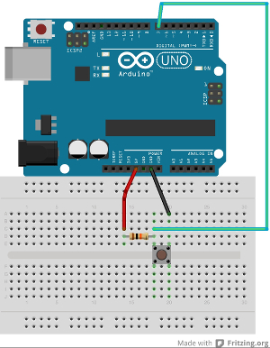

Arduino Etch A Sketch Workshop
======================

## What is an Etch A Sketch?

An Etch A Sketch is a drawing toy that was sold by the Ohio Art Company. It was first sold in the 1960s.  The toy draws a line using two controllers: a knob that changes the horizontal position and a second knob for the vertical position.  To erase what has been drawn, the toy is flipped upside down and is shaken.

We are going to mimic this interaction using Arduino and Processing.  We will use Processing to draw on a computer, and we will control that drawing using two potentiomenters and a tactile button.

## 1. Processing Sketch

### Setting up the sketch
First we set up the sketch as we would any Processing sketch with `setup()` and `draw()` functions.

	void setup() {
		size( 800, 600 );
	}
	
	void draw() {
	
	}

### Drawing with the mouse
Now we are ready to add some interaction.

#### Exercise 1
Create a new Processing sketch.  Use the `ellipse()` shape to draw a trail of circles wherever the mouse goes.

#### Exercise 2
If you haven't already, use variables to control the colour and diameter of the circles.

### Clearing with a key press
Now that we have a trail of circles wherever the mouse moved, we need to add functionality to clear the screen.  We will use the `keyPressed()` function.

	void keyPressed() {
	
	}

The `keyPressed()` function is called whenever a key on the keyboard is pressed.

#### Exercise 3
Using the `background()` function, clear the screen every time a key is pressed.

#### Exercise 4
If you haven't done so already, use a variable or multiple variables to set the background color.

## 2. Adding a Button
We will introduce control from our Arduino by adding a tactile button to clear the screen.

### The circuit
#### Exercise 1
Using a breadboard, Arduino, tactile button and 10k resistor, set up a circuit to read in the state of the button on Digital Pin 7.

### The Arduino code
#### Exercise 2
Write and upload an Arduino sketch that reads in the state of the button on Digital Pin 7 and prints it on the Serial Monitor.  Check that a 1 is printed when the button is not pressed, and a 0 is shown when it is pressed.

### Using internal pull up resistors
The resistor in the button circuit is a called a pull up resistor.  This is because if the switch is open, the signal on the pin on the Arduino reading in the state of the switch is pulled up to 5V.  If this pull up resistor hooked up to 5V wasn't there and the switch was open, the pin would be reading in random values.  We wouldn't know if the pin is reading in 0 because it is actually connected to ground or if it's just a random number.

The Arduino has resistors in the microcontoller that can be used instead of external resistors.  We activate these resistors in code and then have a simpler circuit with fewer components.

#### Exercise 3
Build the below circuit, removing the external pull up resistor from your button circuit.

#### Exercise 4
To activate the internal pull up resistor, we need to add a line to our `setup()` function in our Arduino code.
	pinMode( 7, INPUT ); // this sets up our pin to be an input
	digitalWrite( 7, HIGH ); //this turns on our internal pull up on 7

Confirm that your button still works as before.

### The Processing code
When we use `Serial.print()` in our Arduino code, we are sending information over the Arduino's serial port.  When we open the Serial Monitor in the Arduino IDE, we are reading that data from the Arduino through the computer's serial port.  Processing can access that same serial port and read that data into Processing.

** It is important to note that only one device or application can read from a serial port at a time.  This means if Serial Monitor is open and reading in data, then a Processing sketch also reading in that same data can't be running.  Furthermore, new sketches are loaded onto the Arduino using the serial port, so if you have a Processing sketch running that is accessing the serial port, then you can't upload a new Arduino sketch. **

#### Exercise 5
Processing has a built-in library to handle reading from and writing to a serial port.  Import it by adding

	import processing.serial.*;
	
to the top of your Processing sketch.

Also declare a new `Serial` object as a global variable.

	Serial myPort; // our serial port
	
Inside of `setup()` we instantiate our object.  First we print a list of all serial ports available.

	println(Serial.list()); // print list of all ports
	
Run the sketch and find the number in the list that corresponds to the serial port that your Arduino is plugged into.  It is most likely 0, but it may be another number.

Once you know the number, add the code below to your `setup()` and change the number in the [ ].

	// you may need to change the number in [ ] to match 
	// the correct port for your computer
	myPort = new Serial(this, Serial.list()[0], 9600);
	
We will now use a new function that is called every time there is new data waiting to be read in from the serial port.  This function is defined outside of any other function (it doesn't go inside `setup()` or `loop()`).
	
	/* serialEvent
	this function is called whenever there is data waiting
	on the serial port
	*/
	void serialEvent(Serial p) {
  		
	}

Inside of `serialEvent()` we read in the data and save it in a `String`.
	
	String inString = p.readString(); // read in the string
	
Now print out the data that is read in.

#### Exercise 6
We can remove any extra whitespace (that's things like new lines, tabs and spaces) using a built-in function, `trim`.

	inString = trim( inString );  // remove any whitespace

Add this line to `serialEvent` and see if it changes what is printed.  Try adding some whitespace to what Arduino prints to the serial port and see if it has any effect.

#### Exercise 7
We no longer want a key press to clear the screen, so let's change the `keyPressed()` function.

	/* clearDrawing
	 this function is called when button on Arduino is pressed
	 */
	void clearDrawing() {
		background( bgColor );
	}

Now change the `serialEvent()` function so that the screen is cleared when the data is "0".

Note that since the data is a `String` you will need to do the following to test what the data is:

	if ( inString.equals("0") ) {
	
	}

## 3. Adding the First Knob
We will now add controling the pen from a potentiometer.  For now our button won't work with Processing, but will fix that at the end.

### The circuit
#### Exercise 1
Build a circuit with the Arduino reading in the value from a potentiometer into Analogue Pin 0.

In order to have both the button and potentiometer on the same breadboard you will need to alter the layout in order for both components to access 5V.

 
### The Arduino code
With the button we were only sending one character at a time - either a 0 or 1.  When we read in an analogue value, we can have up to 4 characters at a time (since the analogue inputs can be up to 1023).  We need to know how many digits are in number, so we add a special character to separate consecutive values.  We could use anything, but it's easy to use the newline character `'/n'`.

#### Exercise 2
Write a Arduino sketch that reads the potentiometer value and prints to the serial port with a newline after each value.  Verify it's working by looking at the data stream in the Serial Monitor. 

### The Processing code
We have already set up our Processing sketch to read in data from the serial port, but we can have pay special attention to certain characters.  We can tell it to only call the `serialEvent()` function when a certain character is received.  This lets the data sit and wait for all the characters to arrive before reading in the `String` of our full value.

#### Exercise 3
In your `setup()` function, add the following line after you instantiate the `Serial` object:

	myPort = new Serial(this, Serial.list()[10], 9600);
	myPort.bufferUntil('\n');

Print out the value of `inString` in your `serialEvent()` function and check that the full number is being read in, not only single digits at a time.

#### Exercise 4
In order to use the value being read in as a `int` variable, we need to convert or cast the `String` into an `int`.  The following line does that.

	int v = int(inString); // convert from a string to int

Now that we have an integer that is the value from our potentiometer, change your Processing code so that the potentiometer moves the pen of your drawing left and right (the up and down is still controlled by the mouse).

## 4. Adding the Second Knob
### The circuit
### The Arduino code
### The Processing code

## 5. Putting It All Together

